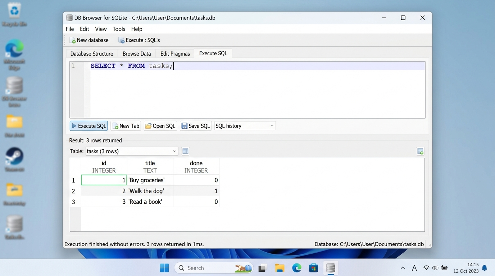

# Task API — SQLite Persistence (Week 3 / A2)

A clean, RESTful CRUD API for managing to-do tasks, built with **Node.js**, **Express**, and **SQLite** (`better-sqlite3`).

This project demonstrates the core architectural principle: **"APIs describe what your application does; databases describe where your application stores its data."** The storage layer has been transitioned from an ephemeral in-memory array to a persistent, disk-backed SQLite database, while preserving 100% of the API contract.

---

## Quickstart

### One Command to Start
```bash
npm install
npm start
```

The server will automatically:
1. Initialize the SQLite database file (`tasks.db`) if it doesn't already exist.
2. Create the `tasks` schema and performance indexes.
3. Automatically seed the initial 3 example tasks if the database is empty.
4. Listen on `http://localhost:3000`.

- **Swagger UI Interactive Documentation**: [http://localhost:3000/docs](http://localhost:3000/docs)

---

## Why SQLite Was Chosen

1. **Single-File Simplicity**: The entire database resides in a single cross-platform disk file (`tasks.db`). No separate database process, port binding, or user permission management is required.
2. **Zero Configuration**: SQLite requires zero installation or runtime server configuration. The database file is created automatically on application launch.
3. **True Persistence**: Unlike in-memory arrays where data disappears on server reboot, SQLite persists rows directly to disk. Your data survives crashes, updates, and restarts.
4. **ACID-Compliant Transactions**: Offers rock-solid reliability with atomic transactions (`db.transaction`), ensuring multi-row operations either completely succeed or roll back with zero corrupted state.
5. **Synchronous & Fast**: With `better-sqlite3`, queries execute synchronously without unnecessary `async/await` overhead, producing clean and deterministic backend code.

---

## Where the Database File Lives

- **File Path**: `./tasks.db` in the repository root.
- **Git Ignored**: `tasks.db` and its journal/WAL files are explicitly listed in `.gitignore`. Every fresh clone or clean checkout boots into an empty state and automatically creates and seeds its own local database.

---

## Database Schema & Indexing

```sql
CREATE TABLE IF NOT EXISTS tasks (
  id INTEGER PRIMARY KEY AUTOINCREMENT,
  title TEXT NOT NULL,
  done INTEGER NOT NULL DEFAULT 0
);

-- Performance indexes for search and filter queries
CREATE INDEX IF NOT EXISTS idx_tasks_done ON tasks(done);
CREATE INDEX IF NOT EXISTS idx_tasks_title ON tasks(title);
```

> **What an index is for**: An index acts like an alphabetical index at the back of a book. Instead of scanning every single row sequentially (full table scan, $O(N)$), SQLite searches a sorted B-tree structure ($O(\log N)$) to instantly locate matching rows by completion status (`done`) or title (`title`).

---

## DB Browser for SQLite Verification

The database file `tasks.db` was inspected and verified using [DB Browser for SQLite](https://sqlitebrowser.org/):



### Example SQL Queries Executed by Hand (Stage 4)

#### Query 1: List all tasks
```sql
SELECT * FROM tasks;
```
**Output:**
```text
(1, 'Buy groceries', 0)
(2, 'Walk the dog', 1)
(3, 'Read a book', 0)
```
*Explanation: Returns every row and column currently stored in the `tasks` table.*

#### Query 2: Filter completed tasks
```sql
SELECT * FROM tasks WHERE done = 1;
```
**Output:**
```text
(2, 'Walk the dog', 1)
```
*Explanation: Filters the rows using a SQL `WHERE` clause, isolating only tasks where `done` equals 1 (true).*

#### Query 3: Count total tasks
```sql
SELECT COUNT(*) FROM tasks;
```
**Output:**
```text
3
```
*Explanation: Evaluates the total number of records directly inside the database engine.*

---

## Endpoints & API Reference

| Method | Endpoint | Description | Status Codes |
|--------|----------|-------------|--------------|
| GET | `/` | API info (name, version, endpoints) | `200` |
| GET | `/health` | Health check | `200` |
| GET | `/stats` | Aggregate task statistics computed in SQL | `200` |
| GET | `/tasks` | List tasks (supports `?search=`, `?done=`, `?sort=`) | `200` |
| GET | `/tasks/:id` | Get single task by ID | `200`, `404` |
| POST | `/tasks` | Create a new task (`{ "title": "..." }`) | `201`, `400` |
| PUT | `/tasks/:id` | Update task title and/or done status | `200`, `400`, `404` |
| DELETE | `/tasks/:id` | Delete task by ID | `204`, `404` |

### Query Parameters for `GET /tasks`
- **Search by keyword**: `GET /tasks?search=dog` (SQL `WHERE title LIKE '%dog%'`)
- **Filter by status**: `GET /tasks?done=true` or `GET /tasks?done=false` (SQL `WHERE done = ?`)
- **Sort alphabetically**: `GET /tasks?sort=title` (SQL `ORDER BY title COLLATE NOCASE ASC`)

---

## Why Storage is "Just an Implementation Detail"

In Assignment 1, the tasks were stored in a JavaScript variable `let tasks = [...]`. In this assignment, tasks are stored on disk in SQLite via `better-sqlite3`.

The client sends the exact same HTTP requests, receives the exact same JSON payloads, and observes the exact same HTTP status codes:
- Identical automated test suites and curl scripts pass against both versions without altering a single character of client code.
- This demonstrates that an **API is a behavioral contract**. As long as the contract is honored, the storage layer underneath can be swapped from memory to SQLite, to PostgreSQL, or to DynamoDB with zero disruption to the consumer.

---

## Seeding & Atomic Transactions

Multi-step seeding is wrapped inside an atomic transaction:
```javascript
const seedTransaction = db.transaction((items) => {
  for (const item of items) {
    insertTask.run(item.title, item.done);
  }
});
seedTransaction(seedTasks);
```
> **Why transactions matter**: Transactions guarantee **Atomicity** (the 'A' in ACID). If inserting task #3 failed, tasks #1 and #2 would be automatically rolled back rather than leaving a half-seeded or corrupted database.

---

## AI vs Me — Stage 7 (Week 2 Rematch)

### Original Assignment 1 Prompt
> Build a CRUD API for managing to-do tasks using Node.js and Express on port 3000. The API should have these endpoints: GET /tasks (list all), GET /tasks/:id (get one), POST /tasks (create, returns 201), PUT /tasks/:id (update), DELETE /tasks/:id (returns 204). Each task has id, title, and done fields. Validate input — if title is missing or empty, return 400. If a task ID doesn't exist, return 404 with a JSON error message. Use an in-memory array, pre-filled with 3 example tasks. Include a GET / endpoint returning API info and a GET /health endpoint.

### Findings from A1 Comparison
- **What the AI did well**: Clean destructuring (`const { title } = req.body`) and standard route commenting.
- **What the AI got wrong**: Silently dropped the `/` and `/health` endpoints, omitted Swagger docs, missed trimming on whitespace titles, and used `completed` instead of `done`.
- **Takeaway**: AI assistants excel at standard templates but frequently make silent assumptions when constraints are not explicitly pinned down in the specification.
